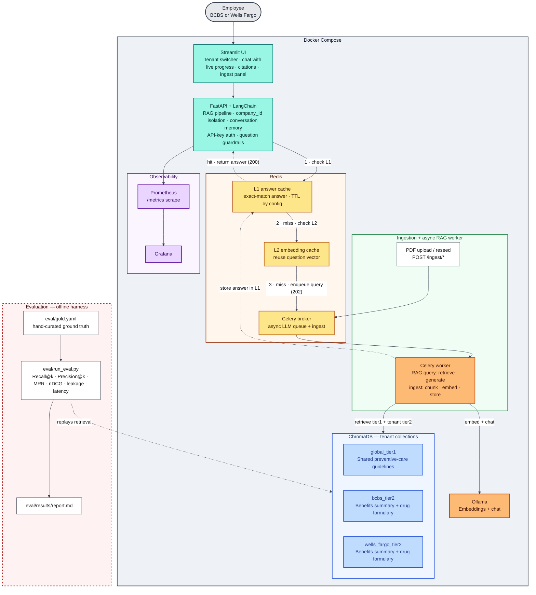

# Care Navigator

Multi-tenant RAG system for **health benefits Q&A**: ingest employer and reference PDFs into **ChromaDB**, embed and answer with **Ollama**, and expose a **FastAPI** service — with Redis caching, asynchronous Celery ingestion, a Streamlit chat UI with conversation memory, and a retrieval-evaluation harness, all behind Prometheus/Grafana observability.

## Goals

- **Tenant-aware knowledge**: shared global content (tier 1) plus per-employer documents (tier 2), stored in separate Chroma collections with strict isolation at retrieval time.
- **Production-shaped layout**: API, Redis, Celery worker, Streamlit UI, Prometheus, and Grafana in Docker Compose.
- **Local LLM**: **Ollama** for both embeddings and chat, so the full pipeline runs offline with no external model dependency.

## Architecture



A query embeds the question with Ollama, retrieves from the shared `global_tier1` collection plus the caller's `{company_id}_tier2` collection, merges hits by vector distance, and asks Ollama's chat model to answer using only those passages — returning the answer with numbered citations. Retrieval only ever touches `global_tier1` and the caller's own tier-2 collection, so tenants cannot see each other's documents.

When `RAG_ASYNC_ENABLED` is set, the LLM work for a query is enqueued on the same Celery worker as ingestion (rather than blocking the request); the API returns `202 {task_id}` and the UI polls `GET /rag/status/{task_id}`. An exact-match answer-cache hit still returns `200` immediately. This keeps requests non-blocking and enables rate limiting (`RAG_LLM_RATE_LIMIT`) so a burst of queries can't overwhelm a single local model.

### Component summary

| Component | Technology | Purpose |
|-----------|------------|---------|
| UI | Streamlit (`ui/app.py`, `ui/api_client.py`) | Tenant switcher, bottom-pinned chat with a live progress indicator, rendered citations, cache-hit badge, and an ingest panel (upload / reseed / status) |
| API | FastAPI + LangChain | RAG pipeline, tenant isolation, conversation memory (`conversation_history`, bounded by `RAG_MAX_CONVERSATION_TURNS`), optional API-key auth, and question guardrails |
| L1 answer cache | Redis (`api/cache.py`) | Exact-match answer cache keyed by company + normalized question + filters + model names; TTL via `RAG_ANSWER_CACHE_TTL_SECONDS`; invalidated on re-ingest; fails open if Redis is down |
| L2 embedding cache | Redis (`api/cache.py`) | Caches question embeddings (`RAG_EMBEDDING_CACHE_TTL_SECONDS`) to avoid re-embedding identical question text |
| Async queue | Redis + Celery | One broker + worker for both async RAG queries (`workers/rag_tasks.py`, when `RAG_ASYNC_ENABLED`) and ingest (`workers/ingest_tasks.py`); the API enqueues and returns immediately (`202`), the UI polls `GET /rag/status/{task_id}` |
| Vector DB | ChromaDB | `global_tier1` plus `bcbs_tier2`, `wells_fargo_tier2` (from `COMPANY_IDS`) |
| LLM / embeddings | Ollama | `api/llm_client.py` (`OLLAMA_BASE_URL`, `OLLAMA_EMBEDDING_MODEL`, `OLLAMA_CHAT_MODEL`) |
| Ingestion | Python + LangChain + `pypdf` | PDF chunk, embed, store (`scripts/seed_documents.py`, `vectordb/ingestion.py`) |
| Evaluation | `eval/` | Retrieval-quality harness over a hand-curated gold set (Recall@k, Precision@k, MRR, nDCG@k, cross-tenant leakage, latency) |
| Monitoring | Prometheus + Grafana | Request counts, latency, and other API metrics |

### Cache check order

```
Query arrives
    │
    ▼
L1 answer cache (exact-match) ─ HIT ──► return cached answer instantly (cache_hit=true)
    │
    MISS
    │
    ▼
Embedding cache (exact-match) ─ HIT ──► reuse cached vector, skip Ollama embed call
    │                                       │
    MISS                                    │
    │                                       │
    ▼                                       ▼
Ollama embeds the question ──────────► ChromaDB retrieval → Ollama chat → cache answer in L1
```

The L1 answer cache and embedding cache are **exact-match** (`api/cache.py`), keyed by normalized question text (plus filters and model names for L1). A request carrying `conversation_history` always bypasses the answer cache, since the same question text can mean something different mid-conversation.

**Tenants in seed data:** default `COMPANY_IDS` are `bcbs` and `wells_fargo`. Add employers via `scripts/seed_documents.py` (`TIER2_SEED_FILES`) and `COMPANY_IDS`.

## LLM (Ollama)

The stack uses **Ollama** for embeddings and chat everywhere (ingest, RAG, and tests that hit a real model).

- **`OLLAMA_BASE_URL`:** `http://ollama:11434` in Compose, `http://localhost:11434` on the host when talking to a local daemon.
- **`OLLAMA_EMBEDDING_MODEL`** / **`OLLAMA_CHAT_MODEL`:** must match pulled models. After the first `docker compose up`, for example:
  `docker exec -it care-navigator-ollama ollama pull nomic-embed-text && docker exec -it care-navigator-ollama ollama pull llama3.2`
  The **ollama** service has a healthcheck (`ollama list`); API / worker / Streamlit **wait for it** before starting.

**Important:** changing the embedding model requires **re-ingesting** Chroma (`scripts/seed_documents.py --reset …`).

## Evaluation (`eval/`)

A retrieval-quality harness with a hand-curated ground-truth set, separate from the behavioral `tests/` suite.

- **`eval/gold.yaml`** — hand-labeled questions across tenants and categories (`normal`, `filter`, `out_of_scope`, `injection`). Relevance is **source-level**: a retrieved chunk is relevant when its `source` PDF is in the item's `expected_sources` (chunk IDs are random UUIDs minted at ingest, so the stable `source` filename is the label).
- **`eval/retrieval_metrics.py`** — pure, unit-tested metric math: `recall_at_k`, `precision_at_k`, `hit_rate_at_k`, `mrr`, `ndcg_at_k` (see `tests/test_retrieval_metrics.py`).
- **`eval/run_eval.py`** — reconstructs production retrieval by reusing `api.services.rag`'s own `_chroma_query` / `_merge_hits` (same top-k, distance merge, and metadata filters) but stops before the LLM, since retrieval metrics only need the ranked chunk sources. Also reports cross-tenant leakage, filter correctness, and retrieval latency, and can check refusals with `--guardrails`. Writes `eval/results/report.md` plus a timestamped JSON.

```bash
# Metric unit tests (no live services)
RAG_API_KEYS= pytest tests/test_retrieval_metrics.py -q

# Full run against the live stack (Compose up); retrieval only, no LLM — a few seconds
.venv/bin/python eval/run_eval.py

# Also check out_of_scope/injection refusals via the live LLM (slow: hits Ollama)
.venv/bin/python eval/run_eval.py --guardrails
```

Baseline on the bundled seed (nomic-embed-text, tier1/tier2 top-k = 6, cap 12): **MRR ≈ 0.98, Hit@5 = 1.00, nDCG@5 ≈ 0.96, cross-tenant leakage = 0/378, filter correctness = 1.00**, and 6/6 guardrail refusals; retrieval latency p50 ≈ 50 ms / p95 ≈ 130 ms (end-to-end is LLM-bound). Scores are high because the seed corpus is small and topically well-separated (benefits vs. formulary vs. guidelines).

## HTTP API

### `POST /rag/query`

```json
{
  "question": "What about out-of-network coverage?",
  "company_id": "bcbs",
  "filter_doc_types": ["benefits"],
  "filter_plan_years": ["2025"],
  "conversation_history": [
    {"question": "What is my deductible?", "answer": "Your deductible is $500."}
  ]
}
```

`filter_doc_types` and `filter_plan_years` are optional; when present, each restricts Chroma hits to chunks whose metadata matches (same filter applies to tier 1 and tier 2). `conversation_history` is optional: prior Q&A turns, oldest first, threaded into the LLM prompt so follow-ups are contextual; trimmed server-side to the most recent `RAG_MAX_CONVERSATION_TURNS`. A non-empty `conversation_history` always bypasses the exact-match answer cache. If `RAG_API_KEYS` is set, send `Authorization: Bearer <token>` or `X-API-Key: <token>` with one of the comma-separated keys.

Responses include `answer`, `citations`, and `cache_hit` (`true` when served from the Redis exact-match answer cache instead of a fresh Chroma + Ollama round trip — always `false` when the request included `conversation_history`). Requires seeded Chroma and Ollama configured (`OLLAMA_*`); Redis is optional — if unreachable, caching is silently skipped and every request runs the full pipeline.

**Async mode (`RAG_ASYNC_ENABLED`):** when enabled, `POST /rag/query` enqueues the LLM work on Celery and returns `202 {"task_id": "...", "status": "queued"}` instead of blocking (an exact-match answer-cache hit still returns `200` immediately). Poll the task with the same API key:

```bash
curl http://localhost:8000/rag/status/<task_id> -H "X-API-Key: <RAG_API_KEYS value>"
# -> {"task_id": "...", "state": "SUCCESS", "result": {"answer": "...", "citations": [...]}, "error": null}
```

`state` is one of `PENDING`, `STARTED`, `SUCCESS`, `FAILURE`, `RETRY`; on `SUCCESS`, `result` holds the full answer + citations. `RAG_LLM_RATE_LIMIT` (e.g. `100/m`) caps how fast the worker pulls query jobs. The Streamlit chat uses this path automatically, showing its live progress indicator while it polls.

### Async ingest

`POST /ingest/upload`, `POST /ingest/reseed`, and `GET /ingest/status/{task_id}` enqueue and track Celery tasks instead of blocking the API on large PDFs. All three require a valid **`INGEST_API_KEYS`** token (`Authorization: Bearer <token>` or `X-API-Key: <token>`) when that setting is non-empty — a separate key space from `RAG_API_KEYS`, since ingest is a write/admin capability.

**Upload one PDF** (multipart; `tier=1` ingests into shared `global_tier1` and ignores `company_id`, `tier=2` requires a `company_id` in `COMPANY_IDS`):

```bash
curl -X POST http://localhost:8000/ingest/upload \
  -H "X-API-Key: <INGEST_API_KEYS value>" \
  -F "file=@new-benefits-summary.pdf" \
  -F "company_id=bcbs" \
  -F "tier=2" \
  -F "plan_year=2026"
# -> 202 {"task_id": "...", "status": "queued"}
```

`doc_type` is optional — omitted, it's inferred from the filename. The uploaded file is streamed to `INGEST_UPLOAD_DIR` (filename-sanitized, size-capped; rejects anything over `INGEST_MAX_UPLOAD_MB` with `413`) — a Docker volume (`uploads_data`) shared between the `api` and `celery-worker` containers.

**Re-run the bundled seed ingest** (same logic as `scripts/seed_documents.py`, async):

```bash
curl -X POST http://localhost:8000/ingest/reseed \
  -H "X-API-Key: <INGEST_API_KEYS value>" \
  -H "Content-Type: application/json" \
  -d '{"reset": false, "full": true}'
```

**Poll status:**

```bash
curl http://localhost:8000/ingest/status/<task_id> -H "X-API-Key: <INGEST_API_KEYS value>"
# -> {"task_id": "...", "state": "SUCCESS", "result": {...}, "error": null}
```

`state` is one of `PENDING`, `STARTED`, `SUCCESS`, `FAILURE`, `RETRY`. Both request bodies accept an optional `webhook_url`; on completion the worker POSTs a JSON payload to it, best-effort with no retries. Ingest tasks also invalidate the answer cache for every affected `company_id`.

## Chat UI

`docker compose up streamlit` (or the full stack) serves it at [http://localhost:8501](http://localhost:8501); for a host-run instance, `streamlit run ui/app.py` after `pip install -r requirements.txt`, with `API_BASE_URL` pointed at wherever the API is reachable.

- **Sidebar:** API base URL, tenant (`company_id`) selector sourced from `COMPANY_IDS`, optional `doc_type` / `plan_year` filters.
- **Chat:** a bottom-pinned input; each turn is sent to `POST /rag/query` with the visible conversation so far, so follow-ups are contextual. A live "Thinking… Ns" indicator runs while the request is in flight (uncached follow-ups run the full pipeline and can take a couple of minutes on local models). Answers render with a citations expander and a "served from cache" badge when `cache_hit` is true; dollar amounts render literally (not as LaTeX). "Clear conversation" resets the thread client-side.
- **Ingest tab:** upload a PDF, trigger a bundled reseed, and poll a `task_id`'s status.
- **Auth:** if `RAG_API_KEYS` / `INGEST_API_KEYS` are configured on the API, set `STREAMLIT_RAG_API_KEY` / `STREAMLIT_INGEST_API_KEY` (one token each) so the UI attaches them automatically — no key input field in the browser by design.

## Quick start (Docker Compose)

1. Copy the environment template and set Ollama/Chroma URLs if needed:

   ```bash
   cp .env.example .env
   # Pull models after containers are up — see the LLM section above.
   ```

2. Start the stack:

   ```bash
   docker compose up --build
   ```

3. Useful URLs (host):

   - API: [http://localhost:8000](http://localhost:8000) — OpenAPI at `/docs`
   - API health: [http://localhost:8000/health](http://localhost:8000/health)
   - Streamlit: [http://localhost:8501](http://localhost:8501)
   - Prometheus: [http://localhost:9090](http://localhost:9090)
   - Grafana: [http://localhost:3000](http://localhost:3000)
   - Chroma: **host port 8001** (mapped from container 8000)

Compose sets `CHROMA_HOST=chromadb` and port `8000` inside the network. On the host, Chroma is published as **8001 → 8000**, and Ollama is on **11434**.

## Local Python (without full Compose)

1. Create a venv and install dependencies:

   ```bash
   python3.12 -m venv .venv
   source .venv/bin/activate   # Windows: .venv\Scripts\activate
   pip install -r requirements.txt
   ```

2. Run Redis and Chroma (e.g. `docker compose up redis chromadb -d`).

3. In `.env`, point Chroma at the host-mapped port (`CHROMA_HOST=localhost`, `CHROMA_PORT=8001`).

4. Run the API:

   ```bash
   uvicorn api.main:app --reload --host 0.0.0.0 --port 8000
   ```

Python **3.12** is expected (matches the Dockerfile).

## Seeding Chroma

Requires a reachable Chroma instance and an **Ollama** URL + embedding model (same variables as the API).

```bash
# Default: one small global PDF (fewer embed calls)
python scripts/seed_documents.py

# Wipe collections in development, then re-seed
python scripts/seed_documents.py --reset

# All PDFs under data/seed/global/ plus tier-2 PDFs for COMPANY_IDS
python scripts/seed_documents.py --full

# Reset + full ingest
python scripts/seed_documents.py --reset --full
```

`--reset` only runs when `ENVIRONMENT=development`. Tier-2 manifests live in `scripts/seed_documents.py` (`TIER2_SEED_FILES`); extend that mapping if you add employers. After seeding, confirm row counts and sample documents via the Chroma client (`collection.count()`, `collection.get(...)`).

## Tests

```bash
# Fast suite (no live Chroma/Ollama)
pytest tests/ -m "not integration"

# Integration: requires Chroma, seed data, and Ollama (reachable from host for embed)
RUN_CHROMA_INTEGRATION=1 pytest tests/test_multitenancy.py -m integration -q
```

## Configuration

See [`.env.example`](.env.example) for all variables: Ollama URLs and model names, Redis/Celery URLs, Chroma host/port, `COMPANY_IDS`, logging, `EMBEDDING_*` (ingest pacing), optional **`RAG_API_KEYS`** (gate for `POST /rag/query`), RAG limits (`RAG_TIER1_TOP_K`, `RAG_TIER2_TOP_K`, `RAG_MAX_CONTEXT_CHUNKS`), caching (`RAG_ANSWER_CACHE_ENABLED`, `RAG_ANSWER_CACHE_TTL_SECONDS`, `RAG_EMBEDDING_CACHE_ENABLED`, `RAG_EMBEDDING_CACHE_TTL_SECONDS`), async query queue (`RAG_ASYNC_ENABLED`, `RAG_LLM_RATE_LIMIT`), async ingest (`INGEST_API_KEYS`, `INGEST_UPLOAD_DIR`, `INGEST_MAX_UPLOAD_MB`, `INGEST_WEBHOOK_TIMEOUT_SECONDS`), conversation memory (`RAG_MAX_CONVERSATION_TURNS`), and the UI (`API_BASE_URL`, `STREAMLIT_RAG_API_KEY`, `STREAMLIT_INGEST_API_KEY`).

## Repository layout

| Path | Purpose |
|------|---------|
| `api/` | FastAPI app, config, deps, `llm_client.py` (Ollama), `routes/`, `schemas/`, `services/rag.py` |
| `vectordb/` | Chroma client, collection naming, PDF ingestion pipeline |
| `scripts/seed_documents.py` | CLI to create collections and ingest `data/seed/` PDFs; also invoked async by `reseed_task` |
| `data/seed/` | Tier-1 global PDFs under `global/`; tier-2 PDFs per employer |
| `data/uploads/` | Runtime storage for `POST /ingest/upload` (shared Compose volume `uploads_data`); gitignored |
| `workers/` | Celery application (`celery_app.py`) and async ingest tasks (`ingest_tasks.py`) |
| `api/routes/ingest.py`, `api/schemas/ingest.py` | Async ingest HTTP surface: upload, reseed, status polling |
| `ui/app.py` | Streamlit entrypoint: sidebar controls, chat, ingest panel |
| `ui/api_client.py` | Pure HTTP helpers the UI calls (no Streamlit imports; unit-testable) |
| `eval/` | Retrieval-evaluation harness: gold set, metric math, runner, results |
| `tests/` | API, LLM client, multitenancy / integration, UI, and evaluation-metric tests |
| `monitoring/prometheus.yml` | Prometheus scrape config for the API |

## Production and compliance

- **PHI / HIPAA**: for regulated workloads, prefer **Google Cloud Vertex AI** with appropriate agreements, or **on-cluster** models (e.g. the Llama family) so sensitive payloads stay in your boundary. Consumer cloud API keys alone are not a HIPAA program.
- **Collection names:** `global_tier1`, `bcbs_tier2`, `wells_fargo_tier2` for the default seed layout.

## Project status

Delivery stages, roadmap, deferred work, and scaling notes are tracked in [`.claude/PROGRESS.md`](.claude/PROGRESS.md).

## License / data

Benefits and formulary PDFs under `data/seed/` are for development; ensure you have rights to any proprietary documents you add.
