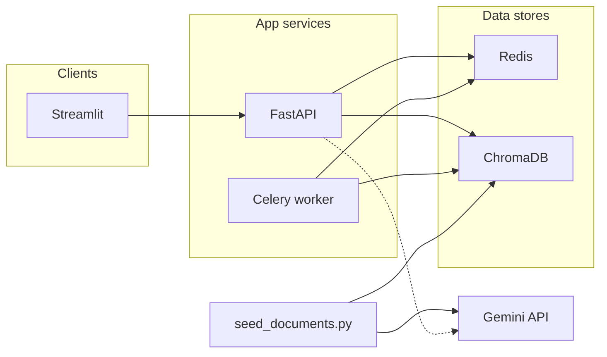
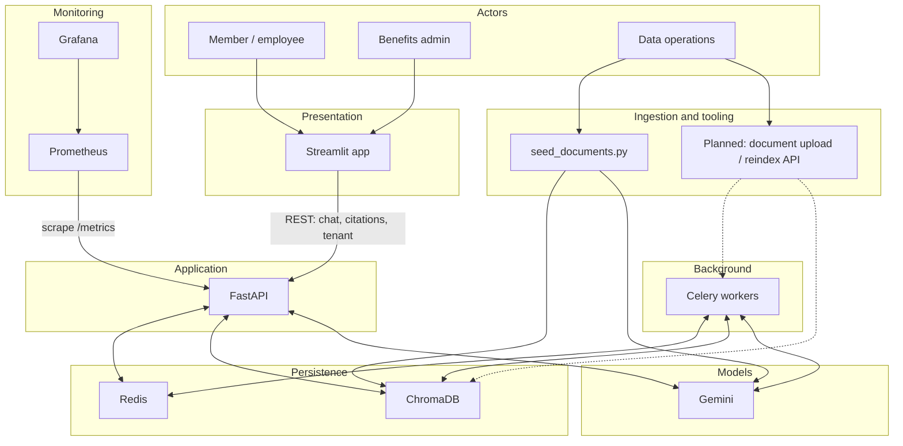

# Care Navigator

Multi-tenant RAG foundation for **health benefits Q&A**: ingest employer and reference PDFs into **ChromaDB**, embed with **Google Gemini**, and expose a **FastAPI** service with observability and worker hooks for future retrieval-augmented chat.

## Goals

- **Tenant-aware knowledge**: shared global content (tier 1) plus per-employer documents (tier 2), stored in separate Chroma collections.
- **Production-shaped layout**: API, Redis, Celery worker, Streamlit shell, Prometheus, and Grafana in Docker Compose.
- **Gemini-first**: chat and embeddings via `langchain-google-genai` and the `google-genai` SDK (not the deprecated `google.generativeai` path).

## Architecture (today — Stages 1–2)



- **ChromaDB** (HTTP): vector store; collections `global_tier1` and `{company_id}_tier2` (e.g. `bcbs_tier2`).
- **Redis**: broker/backend for Celery; reserved for cache and sessions in later stages.
- **Prometheus / Grafana**: scrape FastAPI `/metrics`; Grafana on port 3000 (default admin credentials in Compose).

> **Note:** The API loads Chroma settings but **does not yet call Chroma on HTTP routes**; only ingestion and tests hit the vector store today. The diagram below is the **planned end state**.

## Target architecture (planned)

End-state system: browser UI talks to a **RAG API** that retrieves from **tier-aware Chroma collections**, optionally uses **Redis** for cache and sessions, and generates answers with **Gemini**. **Celery** runs heavy or slow work (re-ingest, batch jobs). **Prometheus / Grafana** stay the observability path. **Batch seeding** remains for dev and baseline corpora; production may add upload-driven ingest via workers.



**Intended request path (RAG):** Streamlit → FastAPI → embed query (Gemini) → Chroma similarity search (global tier 1 + company tier 2, metadata filters) → build context → Gemini chat completion → return answer + source references. Redis can cache query embeddings, retrieval keys, or final answers; Celery can offload large ingests or scheduled re-embeds so the API stays responsive.

## Tech stack

| Area | Choice |
|------|--------|
| API | FastAPI, Uvicorn, Pydantic Settings |
| LLM / embeddings | Gemini (`GEMINI_CHAT_MODEL`, `GEMINI_EMBEDDING_MODEL`) |
| Vectors | ChromaDB 0.5.x (HTTP client) |
| Ingestion | LangChain text splitters, `pypdf`, `GoogleGenerativeAIEmbeddings` |
| Workers | Celery + Redis |
| UI (placeholder) | Streamlit — calls API `/health` only |
| Tests | pytest (unit + optional Chroma/Gemini integration) |

Python **3.12** is expected (see `requirements.txt` / Dockerfile notes).

## Repository layout

| Path | Purpose |
|------|---------|
| `api/` | FastAPI app, config, health routes, Gemini client factory |
| `vectordb/` | Chroma client, collection naming, PDF ingestion pipeline |
| `scripts/seed_documents.py` | CLI to create collections and ingest `data/seed/` PDFs |
| `data/seed/` | Tier-1 global PDFs under `global/`; tier-2 PDFs per employer |
| `workers/` | Celery application |
| `ui/` | Streamlit entrypoint |
| `tests/` | API tests, Gemini client tests, multitenancy / integration tests |
| `monitoring/prometheus.yml` | Prometheus scrape config for the API |

## Progress and roadmap (stages)

| Stage | Status | Scope |
|-------|--------|--------|
| **1 — Foundation** | Done | FastAPI `/health`, `/metrics`, CORS, Dockerfiles, Compose (Redis, Chroma, API, Celery, Streamlit shell, Prometheus, Grafana); minimal Celery app |
| **2 — Vector DB and seed** | Done | Chroma HTTP client, collection naming (`global_tier1`, `{company}_tier2`), PDF → chunk → embed → upsert, `seed_documents.py`, embedding rate limits / retries, pytest + optional Chroma/Gemini integration tests |
| **3 — RAG API** | Planned | Routes: embed user query, query Chroma with tenant + tier rules, assemble context, call Gemini, return answer + citations; OpenAPI docs |
| **4 — Tenancy and policy** | Planned | Request `company_id` / user context validation against `COMPANY_IDS`, metadata filters (e.g. doc_type, plan_year), guardrails for cross-tenant leakage |
| **5 — Caching** | Planned | Redis: session or conversation state, optional embedding cache, optional answer cache with TTL and invalidation on re-ingest |
| **6 — Async operations** | Planned | Celery tasks: large/batch ingest, reindex, optional webhooks; API enqueues work instead of blocking on big PDFs |
| **7 — Product UI** | Planned | Streamlit: tenant selection, chat thread, rendered citations / sources, aligned with the RAG API (replaces health-only placeholder) |

Embedding ingestion today uses **sub-batching, delays, and 429 retries** for Gemini free tier (see `EMBEDDING_*` in `api/config.py`).

## Quick start (Docker Compose)

1. Copy environment template and set your Gemini key:

   ```bash
   cp .env.example .env
   # Edit .env: GEMINI_API_KEY=... (and fix any invalid .env lines so python-dotenv does not warn)
   ```

2. Start the stack:

   ```bash
   docker compose up --build
   ```

3. Useful URLs (host):

   - API: [http://localhost:8000](http://localhost:8000) — OpenAPI at `/docs`
   - API health: [http://localhost:8000/health](http://localhost:8000/health)
   - Streamlit: [http://localhost:8501](http://localhost:8501)
   - Prometheus: [http://localhost:9090](http://localhost:9090)
   - Grafana: [http://localhost:3000](http://localhost:3000)
   - Chroma (mapped from container 8000): **host port 8001** (see below)

Compose sets `CHROMA_HOST=chromadb` and port `8000` inside the network. On the host, Chroma is published as **8001 → 8000**.

## Local Python (without full Compose)

1. Create a venv and install dependencies:

   ```bash
   python3.12 -m venv .venv
   source .venv/bin/activate   # Windows: .venv\Scripts\activate
   pip install -r requirements.txt
   ```

2. Run Redis and Chroma (e.g. `docker compose up redis chromadb -d`).

3. In `.env`, point Chroma at the host-mapped port:

   - `CHROMA_HOST=localhost`
   - `CHROMA_PORT=8001`

4. Run the API:

   ```bash
   uvicorn api.main:app --reload --host 0.0.0.0 --port 8000
   ```

## Seeding Chroma

Requires `GEMINI_API_KEY` and a reachable Chroma instance.

```bash
# Default: one small global PDF (fewer embed calls)
python scripts/seed_documents.py

# Wipe collections in development, then re-seed
python scripts/seed_documents.py --reset

# All PDFs under data/seed/global/ plus tier-2 PDFs for COMPANY_IDS
python scripts/seed_documents.py --full

# With reset + full ingest
python scripts/seed_documents.py --reset --full
```

`--reset` only runs when `ENVIRONMENT=development`. Tier-2 manifests live in `scripts/seed_documents.py` (`TIER2_SEED_FILES`); extend that mapping if you add employers.

## Tests

```bash
# Fast suite (no live Chroma/Gemini)
pytest tests/ -m "not integration"

# Integration: requires Chroma, seed data, and GEMINI_API_KEY
RUN_CHROMA_INTEGRATION=1 pytest tests/test_multitenancy.py -m integration -q
```

## Verifying ingested content

After seeding, you can confirm row counts and sample documents via the Chroma client (`collection.count()`, `collection.get(...)`) or run a `collection.query(...)` using the same embedding model as ingestion. The integration tests in `tests/test_multitenancy.py` embed a query string and assert expected phrases appear in top results.

## Configuration

See [`.env.example`](.env.example) for variables: Gemini keys and models, Redis/Celery URLs, Chroma host/port, `COMPANY_IDS`, logging, and embedding throttle settings (`EMBEDDING_SUB_BATCH_SIZE`, `EMBEDDING_INTER_BATCH_DELAY_SECONDS`, `EMBEDDING_RATE_LIMIT_MAX_RETRIES`).

## License / data

Benefits and formulary PDFs under `data/seed/` are for development; ensure you have rights to any proprietary documents you add.
