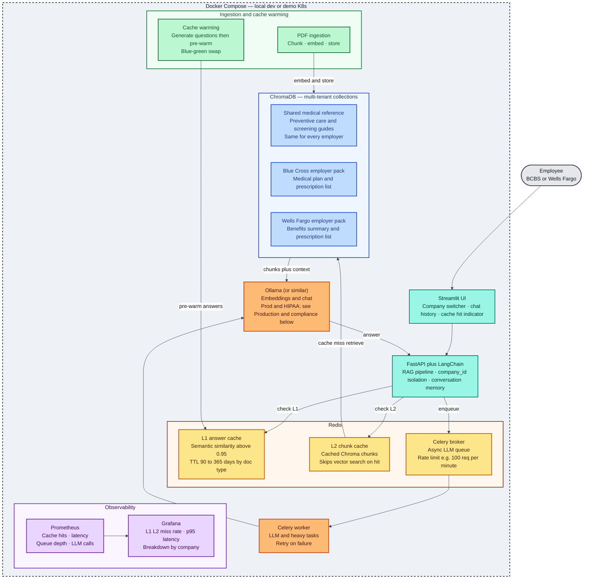

# Care Navigator

Multi-tenant RAG system for **health benefits Q&A**: ingest employer and reference PDFs into **ChromaDB**, embed with **Ollama**, and expose a **FastAPI** service — with Redis caching, async Celery ingest, and a Streamlit chat UI with conversation memory — behind observability.

## Goals

- **Tenant-aware knowledge**: shared global content (tier 1) plus per-employer documents (tier 2), stored in separate Chroma collections.
- **Production-shaped layout**: API, Redis, Celery worker, Streamlit shell, Prometheus, and Grafana in Docker Compose.
- **Local LLM**: **Ollama** for embeddings and chat in Docker Compose, `.env.example`, and application code (Phase C: Google GenAI / Gemini removed).

## Reference architecture (target end-state)

The diagram below is the **portfolio target**: L1/L2 Redis caches, Celery, multi-tenant Chroma (`global_tier1`, `bcbs_tier2`, `wells_fargo_tier2`), a local or hosted LLM, ingestion, cache warming, and observability. The codebase today implements **all 7 stages** (API shell, Chroma + seed, **`POST /rag/query`**, Ollama, optional API keys, metadata filters, question guardrails, Redis answer + embedding cache, async Celery ingest with PDF upload and webhooks, Streamlit chat UI with conversation memory and an ingest panel); only cache warming, semantic/fuzzy L1 matching, L2 chunk-retrieval caching, and LLM-queue rate limiting remain **planned** (see [Future work](#future-work)). The Stage 5 cache is **exact-match**, not the diagram's fuzzy/semantic (>0.95 similarity) L1 — see the note under [Progress and roadmap](#progress-and-roadmap-stages).



> **Implemented today:** FastAPI `/health`, `/metrics`, **`POST /rag/query`** with conversation memory (Stages 3, 7), Compose stack, PDF → chunk → embed → upsert via `scripts/seed_documents.py`, a Redis exact-match answer + embedding cache (Stage 5), async Celery ingest with PDF upload and status polling (Stage 6), a Streamlit chat UI with citations and an ingest panel (Stage 7), and optional integration tests. RAG reads Chroma (`global_tier1` + employer tier 2) and calls **Ollama**; configure `OLLAMA_*`, Chroma host/port, and seed data for end-to-end use.

### Component summary

| Component | Technology | Purpose |
|-----------|------------|---------|
| UI | Streamlit (`ui/app.py`, `ui/api_client.py`) | Tenant switcher, chat thread with citations and cache-hit badge, ingest panel (upload/reseed/status) |
| API | FastAPI + LangChain | RAG pipeline, tenant isolation, **conversation memory** (`conversation_history`, bounded by `RAG_MAX_CONVERSATION_TURNS`; bypasses the Stage 5 answer cache on any follow-up turn) |
| L1 cache | Redis (`api/cache.py`) | **Exact-match** answer cache, TTL-based (`RAG_ANSWER_CACHE_TTL_SECONDS`), invalidated on re-ingest. Semantic/fuzzy (>0.95 similarity) matching is still **planned** |
| L2 cache | Redis (`api/cache.py`) | Question **embedding** cache (`RAG_EMBEDDING_CACHE_TTL_SECONDS`) — avoids re-embedding identical question text. Chunk-retrieval caching (skip Chroma on hit) remains **planned** |
| Queue | Redis + Celery | **Ingest** tasks (`workers/ingest_tasks.py`) run async via Celery (Stage 6): PDF upload and bundled reseed. LLM invocation inside `POST /rag/query` is still synchronous; rate limiting is still **planned** |
| Vector DB | ChromaDB | `global_tier1` plus `bcbs_tier2`, `wells_fargo_tier2` (see `COMPANY_IDS` in config) |
| LLM / embeddings | **Ollama** | `api/llm_client.py` (`OLLAMA_BASE_URL`, `OLLAMA_EMBEDDING_MODEL`, `OLLAMA_CHAT_MODEL`) |
| Ingestion | Python + LangChain + `pypdf` | PDF chunk, embed, store (`scripts/seed_documents.py`, `vectordb/ingestion.py`); reachable async via `POST /ingest/upload` and `POST /ingest/reseed` (Stage 6) |
| Cache warming | Celery (planned) | Pre-warm L1 after upload; blue-green cache swap |
| Monitoring | Prometheus + Grafana | Cache hit rate, latency p95, queue depth |

### Cache check order

```
Query arrives
    │
    ▼
L1 answer cache (exact-match) ─ HIT ──► return cached answer instantly (cache_hit=true)
    │
    MISS
    │
    ▼
L2 embedding cache (exact-match) ─ HIT ──► reuse cached vector, skip Ollama embed call
    │                                          │
    MISS                                       │
    │                                          │
    ▼                                          ▼
Ollama embeds the question ──────────► ChromaDB retrieval → Ollama chat → cache in L1
```

Today's L1/L2 are **exact-match** (`api/cache.py`), keyed by normalized question text (+ filters + model names for L1). The diagram's fuzzy/semantic L1 (>0.95 cosine similarity) and a chunk-level L2 (skip ChromaDB entirely on hit) remain **planned** — see [Future work](#future-work).

**Tenants in seed data:** Default `COMPANY_IDS` are `bcbs` and `wells_fargo`. Add employers via `scripts/seed_documents.py` (`TIER2_SEED_FILES`) and `COMPANY_IDS`.

## Production and compliance

- **PHI / HIPAA**: For regulated workloads, prefer **Google Cloud Vertex AI** with appropriate agreements, or **on-cluster** models (e.g. Llama family) so sensitive payloads stay in your boundary. Cloud consumer API keys alone are not a HIPAA program.
- **Collection names:** `global_tier1`, `bcbs_tier2`, `wells_fargo_tier2` for the default seed layout.

## Scaling (planned)

| Area | Direction |
|------|-----------|
| Workers | **KEDA** (or similar) to scale Celery on **Redis queue depth**, not only CPU |
| Ingress | Multi-region active-active (e.g. Route 53 across `us-east-1` / `us-west-2`) when moving beyond Compose; health checks and stateless API tiers |
| Chroma | Shard or partition by `company_id` as tenant count grows (e.g. dedicated instances or StatefulSets per tenant group) |
| Open enrollment | **Blue-green** (or canary) cache swap so new corpora do not cause a thundering herd on cold L1/L2 |

## Future work

All 7 roadmap stages are done. What's left is scoped-down or explicitly deferred work noted throughout each stage's row below:

- **Semantic (fuzzy) answer cache**: Stage 5 shipped an **exact-match** Redis cache only. Upgrading the L1 answer cache to fuzzy/semantic matching (>0.95 cosine similarity, per the architecture diagram) needs a vector index over past cached questions and similarity-threshold tuning — tracked as a follow-up, not yet implemented. Optional **GPTCache** or a custom semantic layer over Redis remains the likely approach.
- **L2 chunk-retrieval cache**: cache Chroma hits directly (skip vector search on hit), separate from the Stage 5 embedding cache which only avoids re-embedding.
- **Cache warming** after PDF upload or bulk re-ingest; **green → blue** promotion for caches (Stage 6 already invalidates stale answer-cache entries on ingest — pre-warming the replacements is still planned).
- **Grafana**: L1/L2/miss rates, p95 latency, queue depth, **per-company** breakdown (`bcbs` vs `wells_fargo`).
- **Webhook hardening**: Stage 6's `webhook_url` on `POST /ingest/upload` / `POST /ingest/reseed` is a single best-effort POST from an already-authenticated ingest-key holder — it is **not** validated against internal/private IP ranges (no SSRF defenses) and has no retry/backoff. Acceptable for this dev-stage project; worth hardening before a real deployment.
- **LLM task queue**: Stage 6 only made ingestion async — `POST /rag/query` still calls Ollama synchronously in-request; queuing LLM calls through Celery (with the diagram's rate limiting) remains planned.
- **Compliance**: data residency, key management, and model hosting choices documented for PHI.

## Tech stack

| Area | Choice |
|------|--------|
| API | FastAPI, Uvicorn, Pydantic Settings |
| LLM / embeddings | **Ollama** (`api/llm_client.py`) |
| Vectors | ChromaDB 0.5.x (HTTP client) |
| Ingestion | LangChain text splitters, `pypdf`, Ollama embeddings |
| Workers | Celery + Redis |
| UI | Streamlit — chat with conversation memory, citations, ingest panel (`ui/app.py`, `ui/api_client.py`) |
| Tests | pytest (unit + optional Chroma/Ollama integration); `streamlit.testing.v1.AppTest` for the UI |

Python **3.12** is expected (see `requirements.txt` / Dockerfile notes).

## Repository layout

| Path | Purpose |
|------|---------|
| `api/` | FastAPI app, config, deps, `llm_client.py` (Ollama), `routes/`, `schemas/`, `services/rag.py` |
| `vectordb/` | Chroma client, collection naming, PDF ingestion pipeline |
| `scripts/seed_documents.py` | CLI to create collections and ingest `data/seed/` PDFs; also invoked async by `reseed_task` |
| `data/seed/` | Tier-1 global PDFs under `global/`; tier-2 PDFs per employer |
| `data/uploads/` | Runtime storage for `POST /ingest/upload` (shared Compose volume `uploads_data`); gitignored |
| `workers/` | Celery application (`celery_app.py`) and Stage 6 async tasks (`ingest_tasks.py`) |
| `api/routes/ingest.py`, `api/schemas/ingest.py` | Stage 6 async ingest HTTP surface: upload, reseed, status polling |
| `ui/app.py` | Streamlit entrypoint: sidebar tenant/filter controls, Chat tab, Ingest tab |
| `ui/api_client.py` | Stage 7 pure HTTP helpers the UI calls (no Streamlit imports; unit-testable in isolation) |
| `tests/` | API tests, LLM client tests, multitenancy / integration tests |
| `monitoring/prometheus.yml` | Prometheus scrape config for the API |

## Progress and roadmap (stages)

| Stage | Status | Scope |
|-------|--------|--------|
| **1 — Foundation** | Done | FastAPI `/health`, `/metrics`, CORS, Dockerfiles, Compose (Redis, Chroma, API, Celery, Streamlit shell, Prometheus, Grafana); minimal Celery app |
| **2 — Vector DB and seed** | Done | Chroma HTTP client, collection naming (`global_tier1`, `{company}_tier2`), PDF → chunk → embed → upsert, `seed_documents.py`, embedding sub-batching + inter-batch delay for Ollama, pytest + optional Chroma/Ollama integration tests |
| **3 — RAG API** | Done | `POST /rag/query`: embed question, retrieve from `global_tier1` + `{company_id}_tier2`, merge by distance, answer + citations via **Ollama**; OpenAPI under `/docs` |
| **4 — Tenancy and policy** | Done | Optional **API keys** (`RAG_API_KEYS` + `Authorization: Bearer` or `X-API-Key`); Chroma **`filter_doc_types`** / **`filter_plan_years`** on retrieval; **question validation** and stronger system prompt (benefits scope, prompt-injection resistance); `company_id` still validated against `COMPANY_IDS`. Full **SSO/OIDC** is not implemented yet—swap the auth helper or add middleware when you wire an IdP. |
| **5 — Caching** | Done (exact-match) | Redis **answer cache** (`api/cache.py`, keyed by company + normalized question + filters + model names, TTL via `RAG_ANSWER_CACHE_TTL_SECONDS`, invalidated per-company at the end of `scripts/seed_documents.py` ingestion) and **embedding cache** (keyed by model + question text, TTL via `RAG_EMBEDDING_CACHE_TTL_SECONDS`); both fail open if Redis is unreachable. **Not yet implemented:** semantic/fuzzy similarity matching (the diagram's >0.95 cosine L1), L2 chunk-retrieval caching, and session/conversation state (deferred to Stage 7 when the API gains conversation memory) |
| **6 — Async operations** | Done | Celery tasks (`workers/ingest_tasks.py`): `ingest_pdf_task` (chunk/embed/store one uploaded PDF, invalidate affected answer caches) and `reseed_task` (wraps `scripts/seed_documents.py run_ingestion`). HTTP surface (`api/routes/ingest.py`, gated by a dedicated **`INGEST_API_KEYS`**, independent of `RAG_API_KEYS`): `POST /ingest/upload` (multipart PDF, saved to a shared Docker volume, streamed to disk with an `INGEST_MAX_UPLOAD_MB` cap, filename sanitized against path traversal), `POST /ingest/reseed`, and `GET /ingest/status/{task_id}` for polling. Optional best-effort `webhook_url` completion/failure notification (no SSRF hardening — see Future work) |
| **7 — Product UI** | Done | Streamlit (`ui/app.py` + `ui/api_client.py`): tenant selector, chat thread with rendered citations and a cache-hit badge, "Clear conversation"; **conversation memory** added to `POST /rag/query` itself (`conversation_history`, threaded into the LLM prompt, bounded by `RAG_MAX_CONVERSATION_TURNS`, bypasses the Stage 5 answer cache on follow-ups) so multi-turn chat is contextual, not just displayed history. Also includes a basic **Ingest tab** (upload PDF / trigger reseed / poll status) using the Stage 6 endpoints — beyond the original bullet's scope. UI auth (`STREAMLIT_RAG_API_KEY`, `STREAMLIT_INGEST_API_KEY`) is server-side env vars only, no key input in the browser |

Embedding ingestion uses **sub-batching** and an optional **inter-batch delay** (`EMBEDDING_SUB_BATCH_SIZE`, `EMBEDDING_INTER_BATCH_DELAY_SECONDS` in `api/config.py`) to avoid hammering local Ollama on large PDFs.

## LLM (Phase C — Ollama only)

The stack uses **Ollama** for embeddings and chat everywhere (ingest, RAG, tests that hit a real model). There is no `LLM_PROVIDER` switch and no Google GenAI dependency.

- **`OLLAMA_BASE_URL`:** `http://ollama:11434` in Compose, `http://localhost:11434` on the host when talking to a local daemon.
- **`OLLAMA_EMBEDDING_MODEL`** / **`OLLAMA_CHAT_MODEL`:** must match pulled models. After the first `docker compose up`, for example:  
  `docker exec -it care-navigator-ollama ollama pull nomic-embed-text && docker exec -it care-navigator-ollama ollama pull llama3.2`  
  The **ollama** service has a healthcheck (`ollama list`); API / worker / Streamlit **wait for it** before starting.

**Important:** Changing the embedding model requires **re-ingesting** Chroma (`scripts/seed_documents.py --reset …`).

## Quick start (Docker Compose)

1. Copy environment template and set Ollama/Chroma URLs if needed:

   ```bash
   cp .env.example .env
   # Pull models after containers are up — see LLM section above.
   ```

2. Start the stack:

   ```bash
   docker compose up --build
   ```

3. Useful URLs (host):

   - API: [http://localhost:8000](http://localhost:8000) — OpenAPI at `/docs`
   - API health: [http://localhost:8000/health](http://localhost:8000/health)
   - Streamlit: [http://localhost:8501](http://localhost:8501)
   - Prometheus: [http://localhost:9090](http://localhost:9090)
   - Grafana: [http://localhost:3000](http://localhost:3000)
   - Chroma (mapped from container 8000): **host port 8001** (see below)

Compose sets `CHROMA_HOST=chromadb` and port `8000` inside the network. On the host, Chroma is published as **8001 → 8000**. Ollama is on **11434**.

## Local Python (without full Compose)

1. Create a venv and install dependencies:

   ```bash
   python3.12 -m venv .venv
   source .venv/bin/activate   # Windows: .venv\Scripts\activate
   pip install -r requirements.txt
   ```

2. Run Redis and Chroma (e.g. `docker compose up redis chromadb -d`).

3. In `.env`, point Chroma at the host-mapped port:

   - `CHROMA_HOST=localhost`
   - `CHROMA_PORT=8001`

4. Run the API:

   ```bash
   uvicorn api.main:app --reload --host 0.0.0.0 --port 8000
   ```

## Seeding Chroma

Requires a reachable Chroma instance and **Ollama** URL + embedding model (same variables as the API).

```bash
# Default: one small global PDF (fewer embed calls)
python scripts/seed_documents.py

# Wipe collections in development, then re-seed
python scripts/seed_documents.py --reset

# All PDFs under data/seed/global/ plus tier-2 PDFs for COMPANY_IDS
python scripts/seed_documents.py --full

# With reset + full ingest
python scripts/seed_documents.py --reset --full
```

`--reset` only runs when `ENVIRONMENT=development`. Tier-2 manifests live in `scripts/seed_documents.py` (`TIER2_SEED_FILES`); extend that mapping if you add employers.

## Tests

```bash
# Fast suite (no live Chroma/Ollama)
pytest tests/ -m "not integration"

# Integration: requires Chroma, seed data, and Ollama (reachable from host for embed)
RUN_CHROMA_INTEGRATION=1 pytest tests/test_multitenancy.py -m integration -q
```

## Verifying ingested content

After seeding, you can confirm row counts and sample documents via the Chroma client (`collection.count()`, `collection.get(...)`) or run a `collection.query(...)` using the same embedding model as ingestion. The integration tests in `tests/test_multitenancy.py` embed a query string and assert expected phrases appear in top results.

## Configuration

See [`.env.example`](.env.example) for variables: Ollama URLs and model names, Redis/Celery URLs, Chroma host/port, `COMPANY_IDS`, logging, `EMBEDDING_*` (ingest pacing), optional **`RAG_API_KEYS`** (Stage 4 gate for `POST /rag/query`), optional RAG limits (`RAG_TIER1_TOP_K`, etc.), Stage 5 caching (`RAG_ANSWER_CACHE_ENABLED`, `RAG_ANSWER_CACHE_TTL_SECONDS`, `RAG_EMBEDDING_CACHE_ENABLED`, `RAG_EMBEDDING_CACHE_TTL_SECONDS`), Stage 6 async ingest (`INGEST_API_KEYS`, `INGEST_UPLOAD_DIR`, `INGEST_MAX_UPLOAD_MB`, `INGEST_WEBHOOK_TIMEOUT_SECONDS`), and Stage 7 (`RAG_MAX_CONVERSATION_TURNS`, `API_BASE_URL`, `STREAMLIT_RAG_API_KEY`, `STREAMLIT_INGEST_API_KEY`).

**RAG HTTP:** `POST /rag/query` with JSON body, for example:

```json
{
  "question": "What about out-of-network coverage?",
  "company_id": "bcbs",
  "filter_doc_types": ["benefits"],
  "filter_plan_years": ["2025"],
  "conversation_history": [
    {"question": "What is my deductible?", "answer": "Your deductible is $500."}
  ]
}
```

`filter_doc_types` and `filter_plan_years` are optional; when present, each restricts Chroma hits to chunks whose metadata matches (same filter applies to tier 1 and tier 2). `conversation_history` is optional (Stage 7): prior Q&A turns, oldest first, threaded into the LLM prompt so follow-ups are contextual; trimmed server-side to the most recent `RAG_MAX_CONVERSATION_TURNS` regardless of how many are sent. **A non-empty `conversation_history` always bypasses the Stage 5 exact-match answer cache** — the same question text can mean something different mid-conversation, so caching by question text alone would risk returning a stale/wrong answer. If `RAG_API_KEYS` is set in the environment, send `Authorization: Bearer <token>` or `X-API-Key: <token>` with one of the comma-separated keys.

Responses include `answer`, `citations`, and `cache_hit` (Stage 5: `true` when served from the Redis exact-match answer cache instead of a fresh Chroma + Ollama round trip — always `false` when the request included `conversation_history`). Requires seeded Chroma and Ollama configured (`OLLAMA_*`); Redis is optional — if unreachable, caching is silently skipped and every request runs the full pipeline.

## Async ingest (Stage 6)

`POST /ingest/upload`, `POST /ingest/reseed`, and `GET /ingest/status/{task_id}` enqueue and track Celery tasks instead of blocking the API on large PDFs. All three require a valid **`INGEST_API_KEYS`** token (`Authorization: Bearer <token>` or `X-API-Key: <token>`) when that setting is non-empty — a separate key space from `RAG_API_KEYS`, since ingest is a write/admin capability.

**Upload one PDF** (multipart; `tier=1` ingests into shared `global_tier1` and ignores `company_id`, `tier=2` requires a `company_id` in `COMPANY_IDS`):

```bash
curl -X POST http://localhost:8000/ingest/upload \
  -H "X-API-Key: <INGEST_API_KEYS value>" \
  -F "file=@new-benefits-summary.pdf" \
  -F "company_id=bcbs" \
  -F "tier=2" \
  -F "plan_year=2026"
# -> 202 {"task_id": "...", "status": "queued"}
```

`doc_type` is optional — omitted, it's inferred from the filename the same way `scripts/seed_documents.py` infers it for global PDFs. The uploaded file is streamed to `INGEST_UPLOAD_DIR` (a filename-sanitized, size-capped write; rejects anything over `INGEST_MAX_UPLOAD_MB` with `413`) — a Docker volume (`uploads_data`) shared between the `api` and `celery-worker` containers so the worker can read what the API wrote.

**Re-run the bundled seed ingest** (same logic as `scripts/seed_documents.py`, just async):

```bash
curl -X POST http://localhost:8000/ingest/reseed \
  -H "X-API-Key: <INGEST_API_KEYS value>" \
  -H "Content-Type: application/json" \
  -d '{"reset": false, "full": true}'
```

**Poll status:**

```bash
curl http://localhost:8000/ingest/status/<task_id> -H "X-API-Key: <INGEST_API_KEYS value>"
# -> {"task_id": "...", "state": "SUCCESS", "result": {...}, "error": null}
```

`state` is one of `PENDING`, `STARTED`, `SUCCESS`, `FAILURE`, `RETRY`. Both request bodies accept an optional `webhook_url`; on completion the worker POSTs a JSON payload (`{"event": "ingest.completed" | "reseed.completed", "task_id": ..., "status": "success" | "failed", ...}`) to it, best-effort with no retries. Ingest tasks also invalidate the Stage 5 answer cache for every affected `company_id` (all configured companies for a tier-1 upload, since tier-1 content is merged into every tenant's answers; just the one company for tier-2).

## Using the chat UI (Stage 7)

`docker compose up streamlit` (or the full stack) serves it at [http://localhost:8501](http://localhost:8501); for a host-run instance, `streamlit run ui/app.py` after `pip install -r requirements.txt`, with `API_BASE_URL` pointed at wherever the API is reachable (`http://localhost:8000` for a host-run API).

- **Sidebar:** API base URL, tenant (`company_id`) selector sourced from the `COMPANY_IDS` env var, optional `doc_type`/`plan_year` filters.
- **Chat tab:** ask a question via `st.chat_input`; each turn is sent to `POST /rag/query` along with the visible conversation so far (see `conversation_history` above), so follow-ups are contextual. Answers render with a citations expander and a "served from cache" badge when `cache_hit` is true. "Clear conversation" resets the thread client-side (does not affect server-side caching).
- **Ingest tab:** upload a PDF (calls `POST /ingest/upload`), trigger a bundled reseed (`POST /ingest/reseed`), and poll a `task_id`'s status (`GET /ingest/status/{task_id}`) — a thin UI over the Stage 6 endpoints.
- **Auth:** if `RAG_API_KEYS` / `INGEST_API_KEYS` are configured on the API, set `STREAMLIT_RAG_API_KEY` / `STREAMLIT_INGEST_API_KEY` (one token each, matching one of the API's comma-separated values) so the UI attaches them automatically — there is no key input field in the browser by design.

## License / data

Benefits and formulary PDFs under `data/seed/` are for development; ensure you have rights to any proprietary documents you add.
